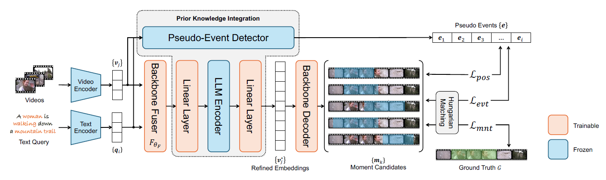

# Prior Knowledge Integration via LLM Encoding and Pseudo-Event Regulation for Video Moment Retrieval

[Yiyang Jiang](https://yyjiang.com/), [Wengyu Zhang](https://wengyuzhang.com), [Xulu Zhang](), [Xiao-Yong Wei](), [Chang Wen Chen](https://web.comp.polyu.edu.hk/chencw/), and [Qing Li]().
</div>

[](https://arxiv.org/abs/2404.00801)
[](https://github.com/yeliudev/R2-Tuning/blob/main/LICENSE)


<p align="center"></p>


[**Installation**](#installation) | [**Dataset**](#dataset) | [**Training**](#training) | [**Evaluation**](#evaluation) | [**Model Zoo**](#model-zoo)

## 📢 News
**[2024.7.21]** Our paper has been accepted by ACM MM 2024 (Oral).

**[2024.7.10]** The code and dataset of related tasks has been released.

**[2024.5.10]** The repository is public.

**[2024.4.10]** The repository is created.


<a name="installation"></a>
## ⚙️ Installation
1. Clone the repository from GitHub.

```shell
git clone https://github.com/fletcherjiang/LLMEPET.git
cd LLMEPET
```

2. Create conda environment.

```shell
conda create -n LLMEPET python=3.8
conda activate LLMEPET
```

3. Download the packages
```shell
pip install -r requirements.txt
```
<a name="dataset"></a>

## 🗂️ Dataset
For all datasets, we provide extracted features, download them and place them into `features/`
- [QVHighlights](https://polyuit-my.sharepoint.com/:u:/g/personal/yiyajiang_polyu_edu_hk/EW28uy57KENIusLy8T_u5ZcB8Stq6sPhPv0zfbhorENrmA?e=K60DvU)
- [Charades-STA](https://polyuit-my.sharepoint.com/:u:/g/personal/yiyajiang_polyu_edu_hk/EaP3G8d6z4VGgZ4qHtjQ_tYBGI6t3-zQCHX48xTeUww9ig?e=L4z64w)
- [TACoS](https://polyuit-my.sharepoint.com/:u:/g/personal/yiyajiang_polyu_edu_hk/EfTC9kZXptlJqr0TxfbV10MBf3CDxT-mguIxiI7_1Tf4Pg?e=WDzwmp)
- [YouTube Highlights](https://polyuit-my.sharepoint.com/:u:/g/personal/yiyajiang_polyu_edu_hk/ERIChtcQPQREsJMCdOng8DcBMzL_uRtv-n822aC3FGgHFA?e=uoxVha)
- [TVSum](https://polyuit-my.sharepoint.com/:u:/g/personal/yiyajiang_polyu_edu_hk/EfEJugMe4jNOr6OjKYwRwskBpdP5Tu9XDu3-pL8jKS0MFQ?e=7w50ow)

### The prepared dataset should be in the following structure.
```
.
├── LLMEPET
│   ├── llm_epet
│   └── data
│   └── results
│   └── run_on_video
│   └── standalone_eval
│   └── utils
├── features
    └── qvhighlight
    └── charades
    └── tacos
    └── tvsum
    └── youtube_uni

```
<a name="training"></a>

## 🚀 Training


<a name="evaluation"></a>

## ⭐ Evaluation

<a name="model zoo"></a>

## 📦 Model Zoo


## 📖 Citation


If you find the repository or the paper useful, please use the following entry for citation.
```
@inproceedings{
jiang2024prior,
title={Prior Knowledge Integration via {LLM} Encoding and Pseudo Event Regulation for Video Moment Retrieval},
author={Yiyang Jiang and Wengyu Zhang and Xulu Zhang and Xiaoyong Wei and Chang Wen Chen and Qing Li},
booktitle={ACM Multimedia 2024},
year={2024},
url={https://openreview.net/forum?id=PPmOOMhMOW}
}
```